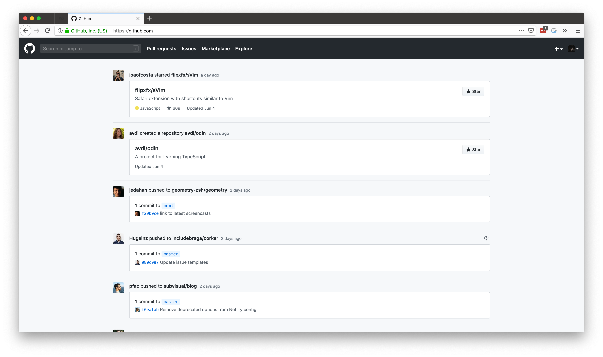

# Shut Up, GitHub!

[![][shield]][homepage]

This is the world's most useless extensions.

I use [Octobox][octobox] to manage my GitHub Notifications. Which means that
when I go to GitHub, I don't want to have my OCD tickled by the notification
indicator.

I tried disabling the web notifications in settings but that means they won't
propagate to Octobox.

So I made this Firefox extension to remove the notification indicator from the
topbar.

And then I got fed up with the GitHub notices and useless sidebars so I removed
everything that wasn't of interest as well.

And that's that. Cheerio.

[octobox]: https://octobox.io
[shield]: https://img.shields.io/static/v1.svg?label=mozilla-add-on&message=v0.2.1&color=FF9400&logo=mozilla-firefox
[homepage]: https://addons.mozilla.org/en-US/firefox/addon/shut-up-github/
